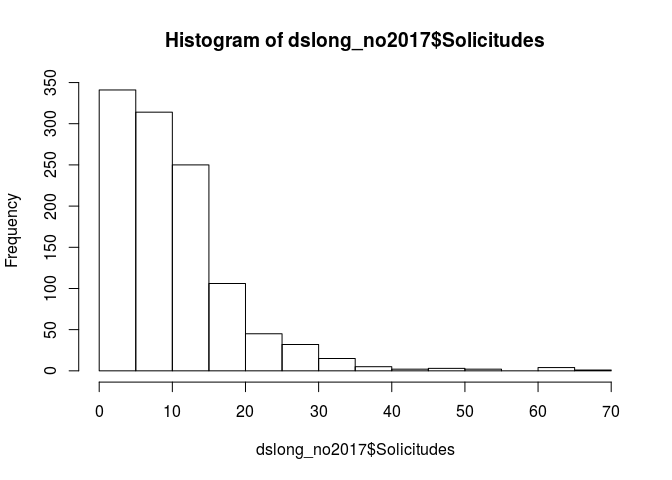
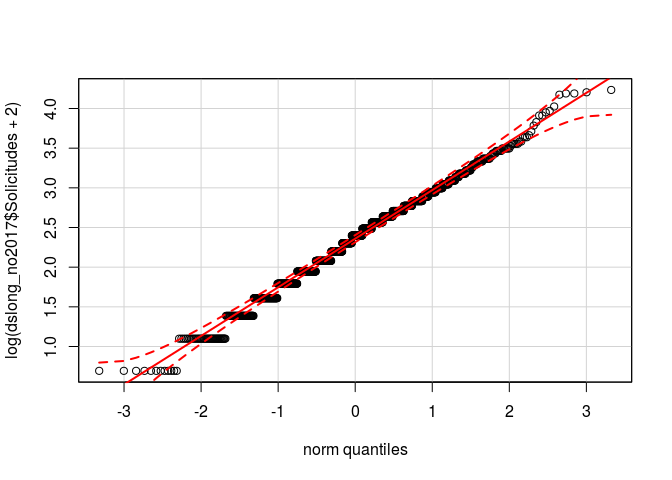

# TFM - Analysis phase
Jose Ignacio Gómez  
November 11, 2017  


## Introduction

Although the objective of the project is to perform an exploratory analysis of the relationship between public schools of Primary education, in the city of Madrid, with respect to the total population of children between 6 and 11 years old (ages covered by the Primary stage), we are going to try to model the number of applications and admissions of the 2017-2018 academic year, based on the data we have.

Load the data set "DataSchools.csv".


```r
dataschools <- read.csv("../3_Data_Munging/csv_files/DataSchools.csv")
```


## Data Munging

We know that there are schools without application and admissions data, so we created a version with complete data only.


```r
dscompletes <- dataschools[complete.cases(dataschools[,11:20]), c(1, 11:26)]
dscompletes$Solicitudes_2017.2018 = NA
dscompletes$Admisiones_2017.2018 = NA
dscompletes <- dscompletes[, c(1:11, 19, 18, 12:17)]
colnames(dscompletes) <- gsub("\\..*","", colnames(dscompletes))
```

The objective is to predict both applications and admissions for the 2017-2018 year from the applications and admissions of previous years (from 2012 to 2016), and other variables in our dataset.

Although at first sight it may make sense to apply some prediction algorithm related to time series, the truth is that our time series have only 5 elements. We have many time series (one for each school), but they are too short. So let's try it with some regression.

To do this, we will first transform our dataset into long format and we format it.


```r
dslong <- reshape(dscompletes, varying = 2:19, sep = "_",
                  timevar = "Curso", direction = "long")
```
    
We goint to separate the data that we want to predict (2017-2018).


```r
dslong_2017 <- subset(dslong, Curso == 2017)
dslong_no2017 <- subset(dslong, Curso != 2017)
```

Let's check if there is some school with number of admissions higher than
applications.


```r
length(dslong_no2017$Colegio[dslong_no2017$Admisiones >
                               dslong_no2017$Solicitudes])
```

```
## [1] 0
```

It's ok.

## Exploratory Analysis

Let's take a look at "Solicitudes" variable.


```r
summary(dslong_no2017$Solicitudes)
```

```
##    Min. 1st Qu.  Median    Mean 3rd Qu.    Max. 
##    0.00    5.00    9.00   10.61   14.00   67.00
```


```r
hist(dslong_no2017$Solicitudes)
```

<!-- -->

It seems that "Solicitudes" variable has positive skew. Let's check it.


```r
library(e1071)
skewness(dslong_no2017$Solicitudes)
```

```
## [1] 2.249037
```

"Solicitudes" variable has a pretty high skew (values above 1 are considered high). Let's calculate the confidence interval, at 95%, of our measure of skewness.


```r
library(boot)
booter <- boot(dslong_no2017$Solicitudes, function(x,i) skewness(x[i]),
               R = 2000)
boot.ci(booter)
```

```
## BOOTSTRAP CONFIDENCE INTERVAL CALCULATIONS
## Based on 2000 bootstrap replicates
## 
## CALL : 
## boot.ci(boot.out = booter)
## 
## Intervals : 
## Level      Normal              Basic         
## 95%   ( 1.827,  2.741 )   ( 1.863,  2.785 )  
## 
## Level     Percentile            BCa          
## 95%   ( 1.713,  2.635 )   ( 1.821,  2.714 )  
## Calculations and Intervals on Original Scale
```

None of the methods used to calculate the confidence interval includes 0, so we can be sure that the distribution of the variable "Solicitudes" is very skewed.
    
We are going to transform the data to try to correct this skewness. Natural logarithm is a method frequently used to transform data with a positive skew. Since some schools do not have applications, we will add an amount to the original score. In this case we are going to add 2.


```r
hist(log(dslong_no2017$Solicitudes + 2))
```

<!-- -->


```r
skewness(log(dslong_no2017$Solicitudes + 2))
```

```
## [1] -0.08086022
```


```r
booter <- boot(log(dslong_no2017$Solicitudes + 2),
               function(x,i) skewness(x[i]),
               R = 2000)
boot.ci(booter)
```

```
## BOOTSTRAP CONFIDENCE INTERVAL CALCULATIONS
## Based on 2000 bootstrap replicates
## 
## CALL : 
## boot.ci(boot.out = booter)
## 
## Intervals : 
## Level      Normal              Basic         
## 95%   (-0.2171,  0.0559 )   (-0.2153,  0.0566 )  
## 
## Level     Percentile            BCa          
## 95%   (-0.2183,  0.0536 )   (-0.2163,  0.0557 )  
## Calculations and Intervals on Original Scale
```

Now we have a more symmetrical variable.
    
Let's check the adjustment of "Solicitudes" to a normal distribution.


```r
library(car)
qqPlot(log(dslong_no2017$Solicitudes + 2))
```

<!-- -->

The adjustment is fair, visually. We are going to apply the Shapiro-Wilk test.


```r
shapiro.test(log(dslong_no2017$Solicitudes + 2))
```

```
## 
## 	Shapiro-Wilk normality test
## 
## data:  log(dslong_no2017$Solicitudes + 2)
## W = 0.99278, p-value = 2.822e-05
```

The result of the Shapiro-Wilk test does not allow us to affirm that our data come from a normal distribution. In any case, we will build our models with both the transformed variable and the original variable.
    
We only want to check if normalizing our dependent variable we get a better fit in our models. So we can continue.
    

## Data Modeling

Let's create a set of training data and a test data set.


```r
dslong_train <- subset(dslong_no2017, Curso < 2016)
dslong_test <- subset(dslong_no2017, Curso == 2016)
```

Let's start with a simple model, and then we will add variables and/or levels.


```r
sol0 <- lm(Solicitudes ~ Colegio, data = dslong_train)
sol0log <- lm(log(Solicitudes + 2) ~ Colegio, data = dslong_train)
```


```r
cat("model0 MSE: ", mean((predict(sol0, dslong_test) -
                            dslong_test$Solicitudes) ** 2))
```

```
## model0 MSE:  29.71987
```

```r
cat("model0log MSE: ", mean(((exp(predict(sol0log, dslong_test)) - 2) -
                               dslong_test$Solicitudes)**2))
```

```
## model0log MSE:  30.91409
```

The model constructed with the original scores has a slightly lower MSE than the one that has used the variable transformed with the natural logarithm.
    
Now we will add the course.


```r
sol1 <- lm(Solicitudes ~ Colegio + scale(Curso), data = dslong_train)
sol1log <- lm(log(Solicitudes + 2) ~ Colegio + scale(Curso),
              data = dslong_train)
```


```r
cat("model1 MSE: ", mean((predict(sol1, dslong_test) -
                            dslong_test$Solicitudes) ** 2))
```

```
## model1 MSE:  29.73547
```

```r
cat("model1log MSE: ", mean(((exp(predict(sol1log, dslong_test)) - 2) -
                               dslong_test$Solicitudes)**2))
```

```
## model1log MSE:  31.70388
```

Including the year of the course to the model, as a fixed effect, does not seem to contribute anything. Let's try a mixed-effects model.
    
We are going to model a response according to which the annual admissions trend, as well as the average admissions, is different for each school. That is, we want a model in which the relationship between the number of applications and the school has a different slope and intercept for each of them.


```r
library(lme4)
sol2 <- lmer(Solicitudes ~ Colegio + (1 + scale(Curso) | Colegio),
             data = dslong_train)
sol2log <- lmer(log(Solicitudes + 2) ~ Colegio + (1 + scale(Curso) | Colegio),
                data = dslong_train)
```


```r
cat("model2 MSE: ", mean((predict(sol2, dslong_test) -
                            dslong_test$Solicitudes) ** 2))
```

```
## model2 MSE:  29.68943
```

```r
cat("model2log MSE: ", mean(((exp(predict(sol2log, dslong_test)) - 2) -
                               dslong_test$Solicitudes)**2))
```

```
## model2log MSE:  29.46345
```

It seems that transformed variable "Solicitudes" works slightly better than the original values in a mixed-effects model. Let's check another model without fixed effects, only random effects.


```r
sol3 <- lmer(Solicitudes ~ (1 + scale(Curso) | Colegio),
             data = dslong_train)
sol3log <- lmer(log(Solicitudes + 2) ~ (1 + scale(Curso) | Colegio),
                data = dslong_train)
```


```r
cat("model3 MSE: ", mean((predict(sol3, dslong_test) -
                            dslong_test$Solicitudes) ** 2))
```

```
## model3 MSE:  29.47447
```

```r
cat("model3log MSE: ", mean(((exp(predict(sol3log, dslong_test)) - 2) -
                               dslong_test$Solicitudes)**2))
```

```
## model3log MSE:  29.42949
```

The MSE improves again, slightly. Attending to the principle of parsimony, simple models, with few variables, are preferable to more complex models. In this case, it seems that, within the mixed models, the simplest one is the one that produces the best predictions, so we could stay with this model. However, we are going to try another model, from a different perspective.
    
From this perspective we could interpret the number of applications from each school as a percentage of the population of each neighborhood. In this case we would be talking about a binomial distribution with a known N (the population of children in each neighborhood) and a probability that would be defined by the logit (inverse-logit) of our linear function. Let's try this.


```r
sol0bin <- glm(Solicitudes/PobxBarrio ~ Colegio, family = "binomial",
               weights = PobxBarrio, data = dslong_train)
```


```r
cat("modelbinom0 MSE: ", mean((predict(sol0bin, dslong_test, type="response") *
                                 dslong_test$PobxBarrio -
                                 dslong_test$Solicitudes) ** 2))
```

```
## modelbinom0 MSE:  31.31811
```

The adjustment with a binomial model works well, but the MSE is greater than the one obtained with the mixed-effects model with Gaussian distribution. We will try to include an interaction between "Colegio" and "Curso".


```r
sol1bin <- glm(Solicitudes/PobxBarrio ~ Colegio:Curso,
               family = "binomial",
               weights = PobxBarrio, data = dslong_train)
```


```r
cat("modelbinom1 MSE: ", mean((predict(sol1bin, dslong_test, type="response") *
                                 dslong_test$PobxBarrio -
                                 dslong_test$Solicitudes) ** 2))
```

```
## modelbinom1 MSE:  30.6467
```

MSE value has been improved with this model,  but it is still smaller than that obtained with our previous fixed effects model.

So far we have compared models based on their MSE, but we could also use other criteria, such as the AIC value, especially indicated for forecasting.
    
First we going to compare the gaussians models with original dependent variable.


```r
AIC(sol0, sol1, sol2, sol3)
```

```
##       df      AIC
## sol0 225 5421.614
## sol1 226 5423.008
## sol2 228 4674.848
## sol3   5 5761.610
```

It seems that the best model is "sol2", that is, the model that has the school as fixed effect, and the school conditioned to the year as random effect, even though, as we saw earlier, the smallest MSE is obtained with "sol3".
    
According to the theory, AIC penalizes overfitting, so it would be a better criterion than the MSE in our specific case. The problem is that we are comparing nor mixed models ("sol0" and "sol1") with mixed models ("sol2" and "sol3"), so there may be problems in the interpretation of the AIC values. For the comparison to be more valid, mixed models should be adjusted by maximum likelihood, that is, with the option RMLE (Restricted Maximum Likelihood Estimation) disabled. Let's try it.


```r
sol2b <- lmer(Solicitudes ~ Colegio + (1 + scale(Curso) | Colegio),
              data = dslong_train, REML = FALSE)
sol3b <- lmer(Solicitudes ~ (1 + scale(Curso) | Colegio),
              data = dslong_train, REML = FALSE)
```


```r
AIC(sol0, sol1, sol2b, sol3b)
```

```
##        df      AIC
## sol0  225 5421.614
## sol1  226 5423.008
## sol2b 228 5363.255
## sol3b   5 5762.045
```

In the comparison, higher AIC values are now seen for models 2 and 3, but even so the model with the lowest AIC is still "sol2".
    
Let's take a look to the models with log-transformed dependent variable.


```r
AIC(sol0log, sol1log, sol2log, sol3log)
```

```
##          df       AIC
## sol0log 225  946.8328
## sol1log 226  943.8551
## sol2log 228 1321.6602
## sol3log   5 1226.4253
```

The AIC values are very much lower than obtained with previous models. This is because the dependent variable ("Solicitudes") is transformed. If we want to compare the AIC values of these models with those of the previous models we have to make a small transformation.


```r
cbind(AIC(sol0log, sol1log, sol2log, sol3log)[,1, drop = FALSE],
      AIC = c(AIC(sol0log) + 2 * sum(log(dslong_train$Solicitudes + 2)),
              AIC(sol1log) + 2 * sum(log(dslong_train$Solicitudes + 2)),
              AIC(sol2log) + 2 * sum(log(dslong_train$Solicitudes + 2)),
              AIC(sol3log) + 2 * sum(log(dslong_train$Solicitudes + 2))))
```

```
##          df      AIC
## sol0log 225 5154.473
## sol1log 226 5151.495
## sol2log 228 5529.300
## sol3log   5 5434.065
```

Regardless of the scale of the AIC values, we observe that for models built with the transformation of the variable "Solicitudes", the lowest AIC is achieved with "sol1", the model that contains the variables "Colegio" and "Curso" as fixed effects.
    
But, again, we have the same problem as before. Let's adjust the mixed models without the RMLE option.


```r
sol2blog <- lmer(log(Solicitudes + 2) ~ Colegio + (1 + scale(Curso) | Colegio),
                 data = dslong_train, REML = FALSE)
sol3blog <- lmer(log(Solicitudes + 2) ~ (1 + scale(Curso) | Colegio),
                 data = dslong_train, REML = FALSE)
```


```r
cbind(AIC(sol0log, sol1log, sol2blog, sol3blog)[,1, drop = FALSE],
      AIC = c(AIC(sol0log) + 2 * sum(log(dslong_train$Solicitudes + 2)),
              AIC(sol1log) + 2 * sum(log(dslong_train$Solicitudes + 2)),
              AIC(sol2blog) + 2 * sum(log(dslong_train$Solicitudes + 2)),
              AIC(sol3blog) + 2 * sum(log(dslong_train$Solicitudes + 2))))
```

```
##           df      AIC
## sol0log  225 5154.473
## sol1log  226 5151.495
## sol2blog 228 5103.436
## sol3blog   5 5429.200
```

Now the best model is the equivalent to "sol2", in its version with the transformed dependent variable. But is there a real improvement of mixed models versus fixed-effect models? Let's find out by means of an anova.


```r
anova(sol3b, sol1, sol0)
```

```
## Data: dslong_train
## Models:
## sol3b: Solicitudes ~ (1 + scale(Curso) | Colegio)
## sol0: Solicitudes ~ Colegio
## sol1: Solicitudes ~ Colegio + scale(Curso)
##        Df    AIC    BIC  logLik deviance    Chisq Chi Df Pr(>Chisq)    
## sol3b   5 5762.0 5786.0 -2876.0   5752.0                               
## sol0  225 5421.6 6501.2 -2485.8   4971.6 780.4309    220     <2e-16 ***
## sol1  226 5423.0 6507.3 -2485.5   4971.0   0.6057      1     0.4364    
## ---
## Signif. codes:  0 '***' 0.001 '**' 0.01 '*' 0.05 '.' 0.1 ' ' 1
```

The mixed model 3 is worse than the fixed-effect models.


```r
anova(sol2b, sol1, sol0)
```

```
## Data: dslong_train
## Models:
## sol0: Solicitudes ~ Colegio
## sol1: Solicitudes ~ Colegio + scale(Curso)
## sol2b: Solicitudes ~ Colegio + (1 + scale(Curso) | Colegio)
##        Df    AIC    BIC  logLik deviance   Chisq Chi Df Pr(>Chisq)    
## sol0  225 5421.6 6501.2 -2485.8   4971.6                              
## sol1  226 5423.0 6507.3 -2485.5   4971.0  0.6057      1     0.4364    
## sol2b 228 5363.3 6457.2 -2453.6   4907.3 63.7533      2  1.433e-14 ***
## ---
## Signif. codes:  0 '***' 0.001 '**' 0.01 '*' 0.05 '.' 0.1 ' ' 1
```

The mixed model 2, on the other hand, improves fixed-effect models.


```r
anova(sol3blog, sol1log, sol0log)
```

```
## Data: dslong_train
## Models:
## sol3blog: log(Solicitudes + 2) ~ (1 + scale(Curso) | Colegio)
## sol0log: log(Solicitudes + 2) ~ Colegio
## sol1log: log(Solicitudes + 2) ~ Colegio + scale(Curso)
##           Df     AIC    BIC  logLik deviance    Chisq Chi Df Pr(>Chisq)
## sol3blog   5 1221.56 1245.5 -605.78  1211.56                           
## sol0log  225  946.83 2026.4 -248.42   496.83 714.7274    220    < 2e-16
## sol1log  226  943.86 2028.2 -245.93   491.86   4.9777      1    0.02568
##             
## sol3blog    
## sol0log  ***
## sol1log  *  
## ---
## Signif. codes:  0 '***' 0.001 '**' 0.01 '*' 0.05 '.' 0.1 ' ' 1
```


```r
anova(sol2blog, sol1log, sol0log)
```

```
## Data: dslong_train
## Models:
## sol0log: log(Solicitudes + 2) ~ Colegio
## sol1log: log(Solicitudes + 2) ~ Colegio + scale(Curso)
## sol2blog: log(Solicitudes + 2) ~ Colegio + (1 + scale(Curso) | Colegio)
##           Df    AIC    BIC  logLik deviance   Chisq Chi Df Pr(>Chisq)    
## sol0log  225 946.83 2026.4 -248.42   496.83                              
## sol1log  226 943.86 2028.2 -245.93   491.86  4.9777      1    0.02568 *  
## sol2blog 228 895.80 1989.7 -219.90   439.80 52.0590      2  4.961e-12 ***
## ---
## Signif. codes:  0 '***' 0.001 '**' 0.01 '*' 0.05 '.' 0.1 ' ' 1
```

With the models that were built with the transformed dependent variable it's the same output. So, we chose model 2 of mixed effects, but which one?, original or transformed dependent variable?


```r
anova(sol2b, sol2blog)
```

```
## Data: dslong_train
## Models:
## sol2b: Solicitudes ~ Colegio + (1 + scale(Curso) | Colegio)
## sol2blog: log(Solicitudes + 2) ~ Colegio + (1 + scale(Curso) | Colegio)
##           Df    AIC    BIC  logLik deviance  Chisq Chi Df Pr(>Chisq)    
## sol2b    228 5363.3 6457.2 -2453.6   4907.3                             
## sol2blog 228  895.8 1989.7  -219.9    439.8 4467.5      0  < 2.2e-16 ***
## ---
## Signif. codes:  0 '***' 0.001 '**' 0.01 '*' 0.05 '.' 0.1 ' ' 1
```

Let's stay with the mixed effects model that uses the transformed "Solicitudes" variable, "sol2log".
    
Since the best predictions of "Solicitudes" have been obtained with a model with Gaussian distribution, we will follow the same steps with "Admisiones".
    
First, let's check "Admisiones" distribution, and transform it if necessary.


```r
summary(dslong_no2017$Admisiones)
```

```
##    Min. 1st Qu.  Median    Mean 3rd Qu.    Max. 
##   0.000   2.000   5.000   5.512   7.000  45.000
```

```r
hist(dslong_no2017$Admisiones)
```

<!-- -->

```r
skewness(dslong_no2017$Admisiones)
```

```
## [1] 2.005089
```

```r
skewness(log(dslong_no2017$Solicitudes + 2))
```

```
## [1] -0.08086022
```

```r
booter <- boot(log(dslong_no2017$Admisiones + 2), function(x,i) skewness(x[i]),
               R = 2000)
boot.ci(booter)
```

```
## BOOTSTRAP CONFIDENCE INTERVAL CALCULATIONS
## Based on 2000 bootstrap replicates
## 
## CALL : 
## boot.ci(boot.out = booter)
## 
## Intervals : 
## Level      Normal              Basic         
## 95%   (-0.1669,  0.0474 )   (-0.1683,  0.0453 )  
## 
## Level     Percentile            BCa          
## 95%   (-0.1658,  0.0478 )   (-0.1618,  0.0554 )  
## Calculations and Intervals on Original Scale
```

Now, let's adjust some models.
    
Model with school.


```r
adm0 <- lm(Admisiones ~ Colegio, data = dslong_train)
adm0log <- lm(log(Admisiones + 2) ~ Colegio, data = dslong_train)
```


```r
cat("model0 MSE: ", mean((predict(adm0, dslong_test) -
                            dslong_test$Admisiones) ** 2))
```

```
## model0 MSE:  21.07003
```

```r
cat("model0log MSE: ", mean(((exp(predict(adm0log, dslong_test)) - 2) -
                               dslong_test$Admisiones)**2))
```

```
## model0log MSE:  16.93798
```

Model with school and yearly trend.


```r
adm1 <- lm(Admisiones ~ Colegio + scale(Curso), data = dslong_train)
adm1log <- lm(log(Admisiones + 2) ~ Colegio + scale(Curso),
              data = dslong_train)
```


```r
cat("model1 MSE: ", mean((predict(adm1, dslong_test) -
                            dslong_test$Admisiones) ** 2))
```

```
## model1 MSE:  16.39438
```

```r
cat("model1log MSE: ", mean(((exp(predict(adm1log, dslong_test)) - 2) -
                               dslong_test$Admisiones)**2))
```

```
## model1log MSE:  12.99366
```

Model with school, applications and yearly trend.


```r
adm2 <- lm(Admisiones ~ Colegio + scale(Curso) + Solicitudes, 
           data = dslong_train)
adm2log <- lm(log(Admisiones + 2) ~ Colegio + scale(Curso) +
                log(Solicitudes + 2), data = dslong_train)
```


```r
cat("model2 MSE: ", mean((predict(adm2, dslong_test) -
                            dslong_test$Admisiones) ** 2))
```

```
## model2 MSE:  12.41675
```

```r
cat("model2log MSE: ", mean(((exp(predict(adm2log, dslong_test)) - 2) -
                               dslong_test$Admisiones)**2))
```

```
## model2log MSE:  8.569032
```

Adding the number of applications to the model really improves it!

Mixed model with school, applications and yearly trend.


```r
adm3 <- lmer(Admisiones ~ Colegio + scale(Curso) + Solicitudes +
               (1 + scale(Curso) | Colegio), data = dslong_train)
adm3log <- lmer(log(Admisiones + 2) ~ Colegio + scale(Curso) +
                  log(Solicitudes + 2) +
                  (1 + scale(Curso) | Colegio), data = dslong_train)
```


```r
cat("model3 MSE: ", mean((predict(adm3, dslong_test) - dslong_test$Admisiones) ** 2))
```

```
## model3 MSE:  12.88986
```

```r
cat("model3log MSE: ", mean(((exp(predict(adm3log, dslong_test)) - 2) - dslong_test$Admisiones)**2))
```

```
## model3log MSE:  8.663207
```

A last mixed model, a little more complicated, just to see how it works from a predictive point of view, since its interpretation would be complicated.


```r
adm4log <- lmer(log(Admisiones + 2) ~ Colegio + scale(Curso) +
                  log(Solicitudes + 2) +
                  (1 + log(Solicitudes + 2) | Colegio) +
                  (1 + scale(Curso) | Colegio), data = dslong_train)
```


```r
cat("model4log MSE: ", mean(((exp(predict(adm4log, dslong_test)) - 2) - dslong_test$Admisiones)**2))
```

```
## model4log MSE:  8.429382
```

It seems that this model improves, very slightly, the fixed-effect model 2, which is much simpler to interpret.

Let's compare models.


```r
adm3b <- lmer(Admisiones ~ Colegio + scale(Curso) + Solicitudes + 
               (1 + scale(Curso) | Colegio), data = dslong_train, REML = FALSE)
adm3blog <- lmer(log(Admisiones + 2) ~ Colegio + scale(Curso) +
                  log(Solicitudes + 2) +
                  (1 + scale(Curso) | Colegio), data = dslong_train,
                REML = FALSE)
adm4blog <- lmer(log(Admisiones + 2) ~ Colegio + scale(Curso) +
                  log(Solicitudes + 2) +
                  (1 + log(Solicitudes + 2) | Colegio) +
                  (1 + scale(Curso) | Colegio), data = dslong_train,
                 REML = FALSE)
```


```r
AIC(adm0, adm1, adm2, adm3b)
```

```
##        df      AIC
## adm0  225 5147.435
## adm1  226 5088.701
## adm2  227 4601.590
## adm3b 230 4524.753
```


```r
cbind(AIC(adm0log, adm1log, adm2log, adm3blog, adm4blog)[,1, drop = FALSE],
      AIC = c(AIC(adm0log) + 2 * sum(log(dslong_train$Admisiones + 2)),
              AIC(adm1log) + 2 * sum(log(dslong_train$Admisiones + 2)),
              AIC(adm2log) + 2 * sum(log(dslong_train$Admisiones + 2)),
              AIC(adm3blog) + 2 * sum(log(dslong_train$Admisiones + 2)),
              AIC(adm4blog) + 2 * sum(log(dslong_train$Admisiones + 2))))
```

```
##           df      AIC
## adm0log  225 4792.763
## adm1log  226 4707.416
## adm2log  227 4097.848
## adm3blog 230 4022.211
## adm4blog 233 4028.211
```

As before, although the best AIC score is for the model 3, with log transformation, models 2 and 4 get a lower MSE score. It's a small difference, both in the AIC and in the MSE, so we will guide us again by the AIC score and we will select model 3, with log transformation, to predict admissions.
    
So we will generate the predictions for the 2017-2018 academic year and add them to the original database.


```r
sol_model <- lmer(log(Solicitudes + 2) ~ Colegio
                  + (1 + scale(Curso) | Colegio),
                  data = dslong_no2017)
dslong_2017$Solicitudes <- exp(predict(sol_model, dslong_2017)) - 2

adm_model <- lmer(log(Admisiones + 2) ~ Colegio + scale(Curso) +
                    log(Solicitudes + 2) +
                    (1 + scale(Curso) | Colegio), data = dslong_no2017)
dslong_2017$Admisiones <- exp(predict(adm_model, dslong_2017)) - 2

dslong_2017$Admisiones[dslong_2017$Admisiones < 0] <- 0
dslong_2017 <- dslong_2017[, c(1,3,4)]
colnames(dslong_2017) <- c("Colegio", "Admisiones_2017.2018",
                           "Solicitudes_2017.2018")
dataschools <- merge(dataschools, dslong_2017, by = "Colegio", all = TRUE)
write.csv(dataschools, file = "../4_Data_Analysis/csv_files/DataSchools.csv",
          row.names = FALSE)
```
